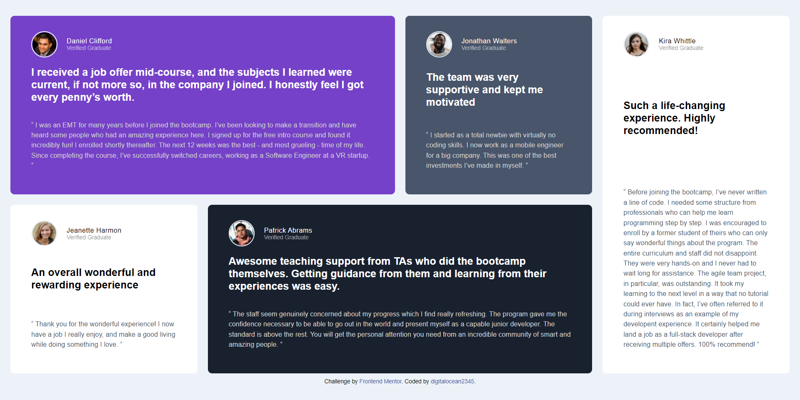

# Frontend Mentor - Testimonials grid section solution

This is a solution to the [Testimonials grid section challenge on Frontend Mentor](https://www.frontendmentor.io/challenges/testimonials-grid-section-Nnw6J7Un7). Frontend Mentor challenges help you improve your coding skills by building realistic projects. 

## Table of contents

- [Overview](#overview)
  - [The challenge](#the-challenge)
  - [Screenshot](#screenshot)
  - [Links](#links)
- [My process](#my-process)
  - [Built with](#built-with)
  - [What I learned](#what-i-learned)
  - [Continued development](#continued-development)
- [Author](#author)

**Note: Delete this note and update the table of contents based on what sections you keep.**

## Overview

### The challenge

Users should be able to:

- View the optimal layout for the site depending on their device's screen size

### Screenshot



### Links

- Solution URL: [https://github.com/digitalocean2345/FEMproject6_TestimonialsGrid]
- Live Site URL: [https://digitalocean2345.github.io/FEMproject6_TestimonialsGrid/]

## My process

### Built with

- Semantic HTML5 markup
- CSS custom properties
- Flexbox
- CSS Grid
- Mobile-first workflow

### What I learned

- use of CSS grid 
- the quotation image can be placed in the purple container using two methods
  - by placing the image in the div and using the position of image as absolute 
  ```
  <div class="quotation">
      
  </div>

  .quotation img{
    position: absolute;
    top: 0;
    right: 8rem;
    max-height: 10.2rem;
    max-width: 10.4rem;
  }
  ```

  - by placing the image in the background
  
  ```
  .purple{
    background: url(./images/bg-pattern-quotation.svg),var(--moderate-violet);
    background-repeat: no-repeat;
    background-position: 75% 0% ;
    background-size: 11rem 13rem;
    color: var(--white);
  }
  ```

### Continued development

- i need to learn the CSS auto grid and minmax function use in css grid.


## Author

- Frontend Mentor - [@digitalocean2345](https://www.frontendmentor.io/profile/digitalocean2345)

**Note: Delete this note and add/remove/edit lines above based on what links you'd like to share.**
